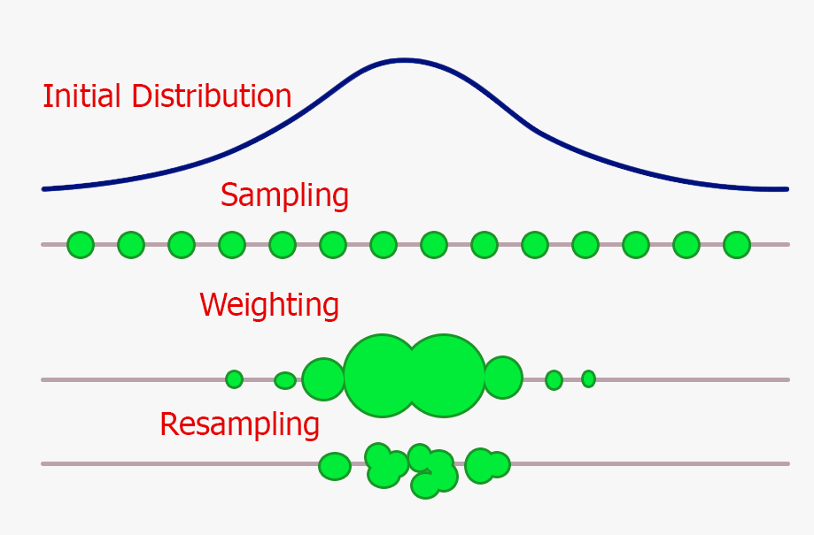
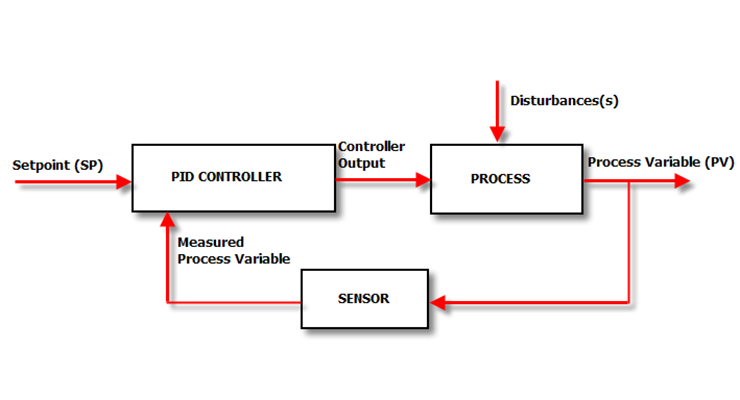
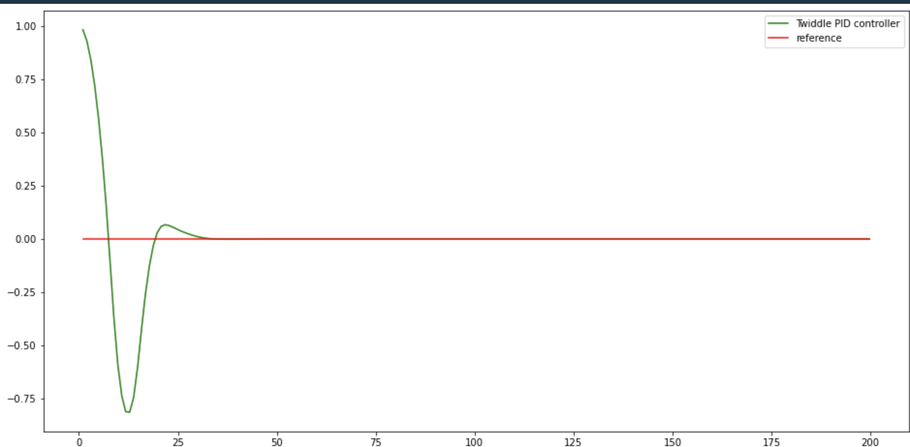
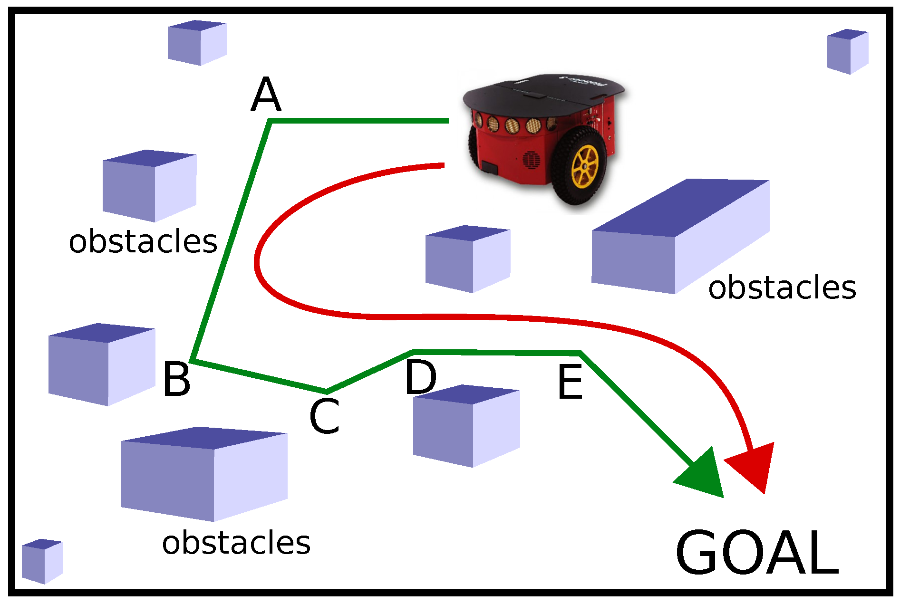
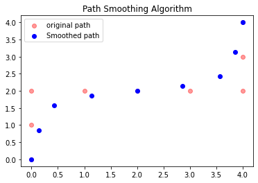

# Simulation and Visualization of Artificial Intelligence Application in Robotics

## Introduction
This project is about various robotic algorithms used in mobile robots. A mobile robot is a machine capable of moving in any environment, either by being propelled by wheels, legs, or any other means. A mobile robot is a machine controlled by software that use sensors and other technology to identify its surroundings and move around its environment. Mobile robots function using a combination of artificial intelligence (AI) and physical robotic elements, such as wheels, tracks and legs. Mobile robots are becoming increasingly popular across different business sectors. They are used to assist with work processes and even accomplish tasks that are impossible or dangerous for human workers. It is designed to perform tasks without human intervention. In the context of this project, a mobile robot is represented by a bicycle/car model.

A bicycle/car model is a simplified model of a two bicycle that is used to represent a mobile robot in many robotics simulations and control algorithms. The model assumes that the robot has four wheels and moves in a plane. It is a commonly used model for studying the control and localization of mobile robots. You can see the model below:


In this project, we will examine several algorithms for localization, tracking, search, PID control, and SLAM in the context of the bicycl/car model. Through animations and simulations, we will explore how these algorithms can be used to control the behavior of a mobile robot.

## Localization and Tracking
In this project, we will be working with various algorithms for mobile robot localization and tracking. The algorithms include the Histogram Filter, Kalman Filter, and Particle Filter. The aim is to localize the robot's position within an environment and track its movements over time. These algorithms provide solutions for the robot's perception of its surroundings and its ability to navigate in a controlled manner. Understanding and implementing these algorithms is crucial for enabling mobile robots to operate autonomously and perform tasks effectively in dynamic and unstructured environments. In the following sections, we will provide an in-depth explanation of each of these algorithms.


### Histogram Filter
The Histogram Filter, also known as Bayes Filter, is a probabilistic algorithm used for localization and tracking. The basic idea of the histogram filter is to use a probability distribution to model the state of a robot. In this filter, the state of the robot is represented by a histogram which represents the probabilities of the robot being in different states. The algorithm uses sensor measurements to update the histogram and update the probabilities of the state of the robot. The Histogram Filter is suitable for problems where the robot's state can be divided into a finite set of discrete states.

The algorithm starts with an initial probability distribution for the state of the robot. This probability distribution is updated at each time step based on the sensor measurements and the motion model of the robot. The motion model describes how the state of the robot changes over time. The sensor model describes how the measurements are related to the state of the robot. The final probability distribution gives us the most likely state of the robot.

In conclusion, the Histogram Filter is a simple and efficient algorithm for problems where the state of the robot can be represented by a discrete set of states. It can provide a good approximation of the state of the robot in real-time, making it useful for various robotic applications such as localization and tracking.

#### Main Histogram Filter Code:

##### The World
```python
p=[0.2, 0.2, 0.2, 0.2, 0.2]
world=['green', 'red', 'red', 'green', 'green']
measurements = ['red', 'green']
motions = [1,1]
pHit = 0.6
pMiss = 0.2
pExact = 0.8
pOvershoot = 0.1
pUndershoot = 0.1
``` 

##### Funtions
```python
def sense(p, Z):
    q=[]
    for i in range(len(p)):
        hit = (Z == world[i])
        q.append(p[i] * (hit * pHit + (1-hit) * pMiss))
    s = sum(q)
    for i in range(len(q)):
        q[i] = q[i] / s
    return q

def move(p, U):
    #
    q = []
    for i in range(len(p)):
        q.append(p[i-U % len(p)])
    return q

```

##### Apply
```python
for k in range(len(measurements)):
    p = sense(p,measurements[k])
    p = move(p,motions[k])
print(p)
>>> [0.21157894736842103, 0.1515789473684211, 0.08105263157894739, 0.16842105263157897, 0.3873684210526316]
``` 

The code above implements the histogram filter algorithm for robot localization. The algorithm is used to estimate the position of a robot in a given environment based on its measurements and movements.

The initial probability distribution of the robot's position is given as p = [0.2, 0.2, 0.2, 0.2, 0.2]. This means that the robot is equally likely to be at any of the five possible positions.

The environment is represented by the world list, which contains the colors of the different positions. In this example, the environment is ['green', 'red', 'red', 'green', 'green'].

The measurements taken by the robot are given as measurements = ['red', 'green']. These measurements are used to update the probability distribution of the robot's position.

The movements of the robot are given as motions = [1, 1]. These movements are used to update the probability distribution of the robot's position.

The probability of hitting the correct color, given a measurement, is given as pHit = 0.6. The probability of missing the correct color, given a measurement, is given as pMiss = 0.2.

The function sense(p, Z) implements the update of the probability distribution based on the measurements. It takes the current probability distribution and the current measurement as inputs and returns the updated probability distribution.

The function move(p, U) implements the update of the probability distribution based on the movements. It takes the current probability distribution and the current movement as inputs and returns the updated probability distribution.

The for loop in the code iterates through the measurements and movements and updates the probability distribution accordingly. After all the iterations, the final probability distribution is printed and represents the estimated position of the robot.

#### Animation
##### One Dimensional Example

##### Two Dimensional Example


### Kalman Filters
Kalman Filter is an algorithm that is widely used in the field of robotics for estimation of the state of a system, especially in the context of localization and tracking. The main aim of the Kalman Filter is to estimate the state of the system and to minimize the estimation error. The algorithm operates in a two-step process. In the first step, the algorithm predicts the next state of the system based on the previous state and the control inputs. In the second step, the algorithm updates the predicted state by taking into account the measurement information.

Kalman Filter is particularly useful in the presence of noisy measurements or uncertain dynamic models. It provides an optimal estimate by taking into account the estimated measurement noise and system model noise. The algorithm also has the ability to handle multi-dimensional systems, making it a suitable choice for mobile robots.

To implement Kalman Filter for a mobile robot, we need to have a mathematical model of the robot and its environment. The robot model should include the robot's kinematic equations, the measurement model, and the process noise. Then, we can use the Kalman Filter algorithm to estimate the state of the robot based on the measurements and control inputs. The algorithm can be implemented using linear algebra and matrix operations, making it computationally efficient for real-time applications.

The Kalman Filter provides a unimodal prediction of the robot's position. It uses a single Gaussian distribution to represent the state of the system, rather than multiple distributions. The algorithm uses the measurement and process models to update the mean and covariance of this Gaussian distribution, providing a single prediction for the state of the system.

In conclusion, the Kalman Filter is a powerful algorithm that provides optimal estimation of the state of a system. Its ability to handle multi-dimensional systems, noisy measurements, and uncertain models make it a popular choice for robotic applications, particularly for localization and tracking.

#### Main Kalman Filter Code:

##### Kalman Filter Function

```python
def kalman_filter(x, P):
    
    for n in range(len(measurements)):
        global u, F, H, R, I
        
        # measurement update
        Z = matrix([[measurements[n]]])
        y = Z - (H*x)
        S = H* P * H.transpose() + R
        K = P * H.transpose() * S.inverse()
        x = x + (K * y)
        P = (I - (K * H)) * P
        
        # prediction
        x = (F * x) + u
        P = F* P *F.transpose()
    return x,P

```

##### Test

```python
measurements = [1, 2, 3]

x = matrix([[0.], [0.]]) # initial state (location and velocity)
P = matrix([[1000., 0.], [0., 1000.]]) # initial uncertainty
u = matrix([[0.], [0.]]) # external motion
F = matrix([[1., 1.], [0, 1.]]) # next state function
H = matrix([[1., 0.]]) # measurement function
R = matrix([[1.]]) # measurement uncertainty
I = matrix([[1., 0.], [0., 1.]]) # identity matrix

result = kalman_filter(x, P)
print('x: ', result[0])
print('P: ', result[1])
# output should be:
# x: [[3.9996664447958645], [0.9999998335552873]]
# P: [[2.3318904241194827, 0.9991676099921091], [0.9991676099921067, 0.49950058263974184]]
```

The main function kalman_filter takes two inputs: x and P. x represents the initial state of the robot, which includes its location and velocity, and P represents the initial uncertainty about the state of the robot.

The function first initializes several variables, including the state transition function F, the measurement function H, the measurement uncertainty R, and the identity matrix I. Then, for each measurement, the function performs a measurement update and a prediction.

In the measurement update step, the function uses the measurement and the measurement function H to calculate the difference between the measurement and the current estimate of the robot's state. This difference is used to calculate the Kalman gain K, which is used to update the state estimate and its uncertainty.

In the prediction step, the function uses the state transition function F to predict the next state of the robot based on its current state and the external motion u. The uncertainty of the predicted state is also updated.

The result of the kalman_filter function is a tuple containing the final estimate of the robot's state and its uncertainty.

The code also includes a test case, which sets the initial state, the initial uncertainty, and the measurement data, and calls the kalman_filter function. The output should be the final estimate of the robot's state and its uncertainty.

#### Animation
##### One Dimensional Example

##### Two Dimensional Example


### Particle Filters
A particle filter is a type of algorithm used for robot localization, which is the process of determining the location and orientation of a robot within a known environment. The particle filter algorithm uses a set of random "particles" that represent possible locations and orientations of the robot.

The algorithm begins by randomly generating a set of particles, each with a different location and orientation. The particles are then moved based on the robot's motion and sensor readings. For example, if the robot moves forward, the particles will also move forward, and if the robot senses an obstacle, the particles will be adjusted to avoid that obstacle.

The algorithm then uses a process called resampling to select the particles that are most likely to represent the true location and orientation of the robot. This is done by comparing the sensor readings from the robot to the sensor readings predicted by the particles. The particles with the highest likelihood of representing the true location and orientation are selected, and the others are discarded.

The process of motion, sensor update, and resampling is repeated many times until the location and orientation of the robot is determined with a high degree of accuracy.

One of the benefits of a particle filter is that it can handle uncertainty and noise in the sensor readings and motion of the robot. It is also computationally efficient and can be used in real-time applications.

The Particle Filter is capable of providing multimodal prediction of the robot's position, meaning that it can estimate the location of the robot in multiple areas. This makes the Particle Filter suitable for environments where the robot's position is uncertain or when there are multiple possible locations.

Resampling is the process of selecting which particles are most likely to represent the true location and orientation of the robot. It's kind of like picking the best guesses out of all the guesses the robot made at the beginning.


*Credit: https://www.lancaster.ac.uk/stor-i-student-sites/martin-dimitrov*

When the robot uses its sensors to look around and gather information, it can use that information to figure out how likely each of its guesses is to be correct. So, it can assign a probability to each particle, based on how well it matches up with the sensor data.

Once it has these probabilities, it can use them to decide which particles to keep and which to get rid of. The particles with the highest probabilities are the ones that are most likely to be right, so the robot will keep those. The particles with the lowest probabilities are the ones that are least likely to be right, so the robot will get rid of those.

By doing this, the robot is able to narrow down its guesses and get closer to figuring out where it is.

#### Main Particle Filter Code:

##### Initialize the World

```python
myrobot = robot()
myrobot = myrobot.move(0.1, 5.0)
Z = myrobot.sense()
N = 1000
T = 10 
```

##### Algorithm

```python
myrobot = robot()
myrobot = myrobot.move(0.1, 5.0)
Z = myrobot.sense()
N = 1000
T = 10 #Leave this as 10 for grading purposes.

p = []
for i in range(N):
    r = robot()
    r.set_noise(0.05, 0.05, 5.0)
    p.append(r)

for t in range(T):
    myrobot = myrobot.move(0.1, 5.0)
    Z = myrobot.sense()

    p2 = []
    for i in range(N):
        p2.append(p[i].move(0.1, 5.0))
    p = p2

    w = []
    for i in range(N):
        w.append(p[i].measurement_prob(Z))

    p3 = []
    index = int(random.random() * N)
    beta = 0.0
    mw = max(w)
    for i in range(N):
        beta += random.random() * 2.0 * mw
        while beta > w[index]:
            beta -= w[index]
            index = (index + 1) % N
        p3.append(p[index])
    p = p3
    print(eval(myrobot,p))
```

The code above is an implementation of a Particle Filter for robot localization. The code defines a robot class with the attributes x, y, orientation, forward_noise, turn_noise, and sense_noise representing the current position and orientation of the robot and the measurement noise for movement and sensing.

In the code, a robot is created with myrobot = robot(). The robot then moves 0.1 units in the x direction and turns 5.0 units to the right with myrobot = myrobot.move(0.1, 5.0). The robot senses its position with Z = myrobot.sense().

A set of N particles p is then created, each with an instance of the robot class and with added measurement noise with r.set_noise(0.05, 0.05, 5.0).

For T time steps, the myrobot moves 0.1 units in the x direction and turns 5.0 units to the right. The set of particles p also moves 0.1 units in the x direction and turns 5.0 units to the right.

For each particle, the weight w is calculated based on the particle's measurement probability measurement_prob given the measurement Z from the myrobot. The particle set p is then resampled based on the weights w, with the most probable particles being selected more often.

Finally, the code outputs the expected position and orientation of the robot given the resampled particle set p using the eval function.

#### Animation
##### Two Dimensional Example


##### Example with Car Model


## Motion Planning/Search Algorithms
Motion planning and search algorithms are techniques used to find the optimal path for a robot to follow from its starting point to its destination. There are several algorithms that can be used for motion planning and search, including Breadth First Search (BFS), A Star, and dynamic programming. These algorithms differ in terms of their approach, efficiency, and the types of problems they can solve.

Motion planning and search algorithms play a crucial role in robotics by helping robots find the optimal path from their starting point to their destination. The choice of algorithm depends on the specific problem being solved and the desired trade-off between efficiency and optimality.


*Features of Search Algorithms*

### Breadth First Search Algorithm
Breadth First Search (BFS) is a search algorithm that is used to find the shortest path from a source node to a goal node. This algorithm works by exploring all possible paths from the source node to the goal node and choosing the path that has the minimum number of edges. BFS is a complete and optimal algorithm, meaning that it will find the shortest path if one exists.

The BFS algorithm starts at the source node and expands the search by exploring all its neighboring nodes first. Once all the neighboring nodes have been explored, the algorithm moves to the next layer of nodes, and so on, until the goal node is found. BFS is guaranteed to find the shortest path in unweighted graphs, but it is not as efficient as other algorithms in large and complex graphs.

#### Main BFS Code:

##### Sample Test Case

```python
grid = [[0, 0, 1, 0, 0, 0],
        [0, 0, 0, 0, 0, 0],
        [0, 0, 1, 0, 1, 0],
        [0, 0, 1, 0, 1, 0],
        [0, 0, 1, 0, 1, 0]]
init = [0, 0]
goal = [len(grid)-1, len(grid[0])-1]
cost = 1

delta = [[-1, 0 ], # go up
         [ 0, -1], # go left
         [ 1, 0 ], # go down
         [ 0, 1 ]] # go right

delta_name = ['^', '<', 'v', '>']
```

##### Search Function

```python
def search():
    closed = [[0 for row in range(len(grid[0]))] for col in range(len(grid))]
    closed[init[0]][init[1]] = 1

    movement = [[-1 for row in range(len(grid[0]))] for col in range(len(grid))]
    path = [[' ' for row in range(len(grid[0]))] for col in range(len(grid))]

    x = init[0]
    y = init[1]
    g = 0

    open = [[g, x, y]]

    found = False  # flag that is set when search is complet
    resign = False # flag set if we can't find expand

    while not found and not resign:
        if len(open) == 0:
            resign = True
            return 'fail'
        else:
            open.sort()
            open.reverse()
            next = open.pop()
            x = next[1]
            y = next[2]
            g = next[0]

            if x == goal[0] and y == goal[1]:
                found = True
            else:
                for i in range(len(delta)):
                    x2 = x + delta[i][0]
                    y2 = y + delta[i][1]
                    if x2 >= 0 and x2 < len(grid) and y2 >=0 and y2 < len(grid[0]):
                        if closed[x2][y2] == 0 and grid[x2][y2] == 0:
                            g2 = g + cost
                            open.append([g2, x2, y2])
                            closed[x2][y2] = 1
                            movement[x2][y2] = i
    x, y = goal
    path[x][y] = '*'
    while x != init[0] or y != init[1]:
        i = movement[x][y]
        dx, dy = delta[i]
        x, y = x-dx, y-dy
        path[x][y] = delta_name[i]
    for i in range(len(movement)):
        print(movement[i])
    for i in range(len(path)):
        print(path[i])
    return path # make sure you return the shortest path.
```

```python

delta_name.append('*')
path = search()
path_list = []
for i in range(len(path)):
    for j in range(len(path[0])):
        if path[i][j] in delta_name:
            path_list.append([i,j])
print(path_list)
for i in range(len(path)):
    print(path[i])

visualize(grid, path_list)
```

##### Output


### A* Search Algorithm
A Star is an algorithm used for finding the shortest path between two nodes in a weighted graph. Unlike BFS, which does not take into account the distances between nodes, A Star takes into account the distances between nodes and assigns a cost to each edge. The algorithm uses a heuristic function to estimate the cost of reaching the goal node from a given node. This allows A Star to prioritize the search and focus on the most promising paths.

A Star is an optimal algorithm, meaning that it will find the shortest path if one exists. The algorithm starts at the source node and adds it to a priority queue, with the priority determined by the estimated cost to reach the goal node. The algorithm then selects the node with the lowest cost and expands the search to its neighbors. The process continues until the goal node is found or there are no more nodes to explore.

#### Main A* Code:

##### Sample Test Case

```python
grid = [[0, 1, 0, 0, 0, 1],
        [0, 1, 0, 1, 0, 1],
        [0, 1, 0, 0, 0, 0],
        [0, 1, 0, 1, 1, 0],
        [0, 0, 0, 0, 1, 0]]

heuristic = [[9, 8, 7, 6, 5, 4],
             [8, 7, 6, 5, 4, 3],
             [7, 6, 5, 4, 3, 2],
             [6, 5, 4, 3, 2, 1],
             [5, 4, 3, 2, 1, 0]]

init = [0, 0]
goal = [len(grid)-1, len(grid[0])-1]
cost = 1

delta = [[-1, 0 ], # go up
         [ 0, -1], # go left
         [ 1, 0 ], # go down
         [ 0, 1 ]] # go right

delta_name = ['^', '<', 'v', '>']
```

##### Search Function

```python
def search(grid,init,goal,cost,heuristic):
    closed = [[0 for col in range(len(grid[0]))] for row in range(len(grid))]
    closed[init[0]][init[1]] = 1

    movement = [[-1 for row in range(len(grid[0]))] for col in range(len(grid))]
    path = [[' ' for row in range(len(grid[0]))] for col in range(len(grid))]

    x = init[0]
    y = init[1]
    g = 0
    f = g + heuristic[x][y]

    open = [[f, g, x, y]]

    found = False  # flag that is set when search is complete
    resign = False # flag set if we can't find expand
    count = 0
    
    while not found and not resign:
        if len(open) == 0:
            resign = True
            return "Fail"
        else:
            open.sort()
            open.reverse()
            next = open.pop()
            x = next[2]
            y = next[3]
            g = next[1]
            f = next[0]
            count += 1
            
            if x == goal[0] and y == goal[1]:
                found = True
            else:
                for i in range(len(delta)):
                    x2 = x + delta[i][0]
                    y2 = y + delta[i][1]
                    if x2 >= 0 and x2 < len(grid) and y2 >=0 and y2 < len(grid[0]):
                        if closed[x2][y2] == 0 and grid[x2][y2] == 0:
                            g2 = g + cost
                            f2 = g2 + heuristic[x2][y2]
                            open.append([f2, g2, x2, y2])
                            closed[x2][y2] = 1
                            movement[x2][y2] = i
    x, y = goal
    path[x][y] = '*'
    while x != init[0] or y != init[1]:
        i = movement[x][y]
        dx, dy = delta[i]
        x, y = x-dx, y-dy
        path[x][y] = delta_name[i]
    for i in range(len(movement)):
        pass
        # print(movement[i])
    for i in range(len(path)):
        pass
        # print(path[i])
    return path # make sure you return the shortest path.
```

```python
delta_name.append('*')
path = search(grid, init,goal,cost, heuristic)
path_list = []
for i in range(len(path)):
    for j in range(len(path[0])):
        if path[i][j] in delta_name:
            path_list.append([i,j])
print(path_list)
for i in range(len(path)):
    print(path[i])

visualize(grid, path_list)
```

##### Output


### Dynamic Programming
Dynamic programming is a technique used to solve optimization problems by breaking them down into smaller subproblems. The idea is to solve each subproblem only once and store the results, so that they can be reused later. This approach allows for significant savings in computation time and is particularly useful for solving problems with overlapping subproblems.

Dynamic programming can be used for motion planning and search problems by breaking down the problem into smaller subproblems and solving them iteratively. The algorithm starts by defining the initial state and the goal state, and then solves each subproblem in a bottom-up fashion, until the final solution is found. Dynamic programming is particularly useful for problems with large state spaces, as it allows for a more efficient and optimized solution.

#### Main Dynamic Programming Code:

##### Sample Test Case

```python
grid = [[0, 1, 0, 0, 0, 0],
        [0, 1, 0, 0, 0, 0],
        [0, 1, 0, 0, 0, 0],
        [0, 1, 0, 0, 0, 0],
        [0, 0, 0, 0, 1, 0]]
init = [0, 0]
goal = [len(grid)-1, len(grid[0])-1]
cost = 1 # the cost associated with moving from a cell to an adjacent one

delta = [[-1, 0 ], # go up
         [ 0, -1], # go left
         [ 1, 0 ], # go down
         [ 0, 1 ]] # go right

delta_name = ['^', '<', 'v', '>']
```

##### Search Function

```python
def optimum_policy(grid,goal,cost):
    # ----------------------------------------
    # modify code below
    # ----------------------------------------
    value = [[99 for row in range(len(grid[0]))] for col in range(len(grid))]
    change = True

    while change:
        change = False

        for x in range(len(grid)):
            for y in range(len(grid[0])):
                if goal[0] == x and goal[1] == y:
                    if value[x][y] > 0:
                        value[x][y] = 0

                        change = True

                elif grid[x][y] == 0:
                    for a in range(len(delta)):
                        x2 = x + delta[a][0]
                        y2 = y + delta[a][1]

                        if x2 >= 0 and x2 < len(grid) and y2 >= 0 and y2 < len(grid[0]) and grid[x2][y2] == 0:
                            v2 = value[x2][y2] + cost

                            if v2 < value[x][y]:
                                change = True
                                value[x][y] = v2
    
    policy = [[' ' for x in range(len(grid[0]))] for y in range(len(grid))]
    for x in range(len(grid[0])):
        for y in range(len(grid)):
            if value[y][x] == 99:
                continue
            if value[y][x] == 0:
                policy[y][x] = '*'
                continue
            surroundingCells = [99,99,99,99]
            for i in range(len(delta)):
                x2 = x + delta[i][1]
                y2 = y + delta[i][0]
                if x2 >= 0 and x2 < len(grid[0]) and y2 >= 0 and y2 < len(grid):
                    surroundingCells[i] = value[y2][x2]
            minVal = min(surroundingCells)
            for j in range(len(surroundingCells)):
                if surroundingCells[j] == minVal and minVal != 99:
                    policy[y][x] = delta_name[j]

    return policy
```

```python
policy = optimum_policy(grid, goal, cost)
visualize_policy(grid, policy)
```

##### Output


#### Animation
##### A star

##### Dynamic Programming


## PID Control

In the context of robotics, control refers to the design, implementation, and operation of systems that manipulate physical variables to achieve desired performance or behavior. This involves the use of feedback, algorithms, and mathematical models to regulate the actions of the robot and ensure that it functions in a stable, predictable, and desired manner.

The goal of control in robotics is to allow the robot to interact with its environment in a manner that accomplishes specific tasks or objectives. This may involve controlling the motion of the robot, the orientation of its sensors or manipulators, or other physical properties of the robot or its environment. The control system typically uses sensors and actuators to receive and respond to signals from the environment, and algorithms to process and interpret these signals to determine the appropriate control inputs.

In general, control is a critical component of robotics, as it enables the robot to interact with and respond to its environment in a controlled and meaningful way. Without control, the robot would simply move or react in an uncontrolled manner, making it difficult to accomplish specific tasks or objectives.

Some of the common control algorithms in robotics are:

    - Proportional Integral Derivative (PID) Controller: It is a widely used control algorithm that adjusts the control signal based on the error, its integral and its derivative.

    - Linear Quadratic Regulator (LQR): It is a control algorithm that optimizes a quadratic cost function that takes into account the state and control inputs of the system.

    - Model Predictive Control (MPC): It is a control algorithm that uses a model of the system to predict future states and optimizes a cost function that takes into account both the current state and future states of the system.

    - State Feedback Control: It is a control algorithm that uses the state of the system to generate a control signal.

    - Adaptive Control: It is a control algorithm that adjusts its parameters based on the behavior of the system over time.

    - Feedback Linearization: It is a control algorithm that linearizes a non-linear system by using feedback from the system.

PID stands for Proportional, Integral and Derivative. It is a control algorithm used to regulate the behavior of a system. The goal of a PID controller is to ensure that a system behaves as expected by continuously comparing the desired output with the actual output and using the error to adjust the control inputs.

There are three main components of a PID controller:

    1. Proportional control: Proportional control adjusts the control input based on the magnitude of the error between the desired and actual outputs. The greater the error, the larger the control input.

    2. Integral control: Integral control takes into account the accumulated error over time. It adjusts the control input based on the accumulated error, helping to eliminate systematic bias.

    3. Derivative control: Derivative control adjusts the control input based on the rate of change of the error. It helps to stabilize the system and prevent overshoot.


*Credit: https://www.motioncontroltips.com*

PID controllers are widely used in various systems, including control of temperature, speed, and position in robotics, aviation and industrial processes.

One of the advantages of PID controllers is that they are able to effectively handle systems with significant non-linearities, making them ideal for use in a wide range of applications. Additionally, they are simple to implement and require only basic knowledge of control theory.

There are many different variations of PID controllers, including PI controllers, PD controllers, and PID controllers with various filter designs. The most common type of PID controller is the standard PID controller, which uses all three components of proportional, integral and derivative control.

The main disadvantage of PID controllers is that they can become unstable if the gain parameters are not properly set, leading to oscillations and other undesirable behavior. Additionally, they may not always be able to achieve optimal performance, particularly in systems with significant time delays or complex dynamics.

#### Main PID Control Code:

##### Initialization of the Robot

```python
robot = Robot()
robot.set(0, 1, 0)
robot.set_steering_drift(10.0/180.0*3.14) # add steering wheel 
```

#### PID Function

```python
def run(robot, tau_p, tau_d, tau_i, n=200, speed=1.0):
    x_trajectory = []
    y_trajectory = []
    # TODO: your code here
    prev_cte = robot.y
    int_cte = 0
    for i in range(n):
        cte = robot.y
        diff_cte = (cte - prev_cte) / speed
        prev_cte = cte
        int_cte += cte
        steer = -tau_p * cte - tau_d * diff_cte - tau_i * int_cte
        robot.move(steer, speed)
        x_trajectory.append(robot.x)
        y_trajectory.append(robot.y)
    return x_trajectory, y_trajectory
```

#### Visualization

```python
x_trajectory, y_trajectory = run(robot,  0.2, 3.0,0.004)
n = len(x_trajectory)

fig, ax = plt.subplots(1, 1, figsize=(16, 8))
ax.plot(x_trajectory, y_trajectory, 'g', label='PID controller')
ax.plot(x_trajectory, np.zeros(n), 'r', label='reference')
ax.legend()
plt.show()
```

#### Output


*P controller*

*PD controller*

*PID controller*

### Systematic Bias
What happens to the robot when it has improperly aligned wheels? It causes large cross-track error. So Integral controller if solving the problem as you see below.


*PD controller with Noise*

*PID controller with Noise*

### Parameter Optimization
One important question remains in order for us to effectively implement the PID controller: how can we determine the optimal parameters (also known as control gains) to use? What we will use is an algorithm called “Twiddle” that adjusts parameters one at a time to find an optimal set.

The Twiddle algorithm is a well-known optimization technique for finding the optimal parameters for a control system. This algorithm is particularly useful in robotics, where the parameters of the control system need to be fine-tuned to achieve the desired performance. In this section, we will provide a detailed mathematical explanation of the Twiddle algorithm and its use in optimizing the parameters of a robot control system.

The Twiddle algorithm works by iteratively adjusting the parameters of the control system until an optimal set of parameters is found. The algorithm starts with an initial set of parameters, which are then adjusted by small amounts in each iteration. The parameters are adjusted in such a way that the performance of the control system is improved in each iteration. The iteration continues until the improvement in performance is less than a specified tolerance, at which point the algorithm stops.

```python
def twiddle(tol=0.2): 
    # TODO: Add code here
    # Don't forget to call `make_robot` before you call `run`!
    p = [0.0, 0.0, 0.0]
    dp = [1.0, 1.0, 1.0]
    robot = make_robot()
    x_trajectory, y_trajectory, best_err = run(robot, p)

    it = 0
    while sum(dp) > tol:
        print("Iteration {}, best error = {}".format(it, best_err), end='\r')
        time.sleep(.1)
        for i in range(len(p)):
            p[i] += dp[i]
            robot = make_robot()
            x_trajectory, y_trajectory, err = run(robot, p)

            if err < best_err:
                best_err = err
                dp[i] *= 1.1
            else:
                p[i] -= 2 * dp[i]
                robot = make_robot()
                x_trajectory, y_trajectory, err = run(robot, p)

                if err < best_err:
                    best_err = err
                    dp[i] *= 1.1
                else:
                    p[i] += dp[i]
                    dp[i] *= 0.9
        it += 1
    return p, best_err
```

```python
params, err = twiddle()
print("Final twiddle error = {}".format(err))
robot = make_robot()
x_trajectory, y_trajectory, err = run(robot, params)
n = len(x_trajectory)

fig, ax1 = plt.subplots(1, 1, figsize=(16, 8))
ax1.plot(x_trajectory, y_trajectory, 'g', label='Twiddle PID controller')
ax1.plot(x_trajectory, np.zeros(n), 'r', label='reference')
ax1.legend()
plt.show()
```

*Result after Twiddle Algorithm*
### Smoothing
You don’t want the robot to go straight, take a 90-degree turn, then go straight again. A car cannot even make a 90-degree turn, and this route will force the robot to move really slowly around the corners.

*Credit: Path Smoothing Techniques in Robot Navigation: State-of-the-Art, Current and Future Challenges*

Path smoothing is a common technique used in robotics and control systems to improve the quality and safety of a robot's path. The goal of path smoothing is to take a rough or jerky path and smooth it out, making it smoother and more predictable. There are several algorithms used to achieve this goal, including:

    - Bezier Curves:
    Bezier curves are a type of curve that are often used for path smoothing in robotics. They are defined by a set of control points, which can be adjusted to create different shapes. In robotics, the control points are typically the waypoints along the path, and the curve is used to create a smooth transition between them.

    - Splines:
    Splines are a type of curve that can be used for path smoothing in robotics. They are similar to Bezier curves in that they are defined by control points, but they are more flexible and can handle more complex shapes. In robotics, splines are often used to create smooth, natural-looking paths, especially in applications where the robot is moving through 3D space.

    - Gaussian Process Regression:
    Gaussian Process Regression (GPR) is a type of machine learning algorithm that can be used for path smoothing. It uses a probabilistic model to predict the shape of the path based on data from previous movements. This makes it well-suited for use in robotics, where the path can change over time as the environment changes or the robot encounters unexpected obstacles.

In general, path smoothing is an important technique for improving the performance and safety of robots. By creating smoother, more predictable paths, robots can move more efficiently and avoid collisions or other problems that might arise from jerky or unpredictable movements

```python
path = [[0, 0],
        [0, 1],
        [0, 2],
        [1, 2],
        [2, 2],
        [3, 2],
        [4, 2],
        [4, 3],
        [4, 4]]

def smooth(path, weight_data = 0.1, weight_smooth = 0.1, tolerance = 0.000001):
    global newpath
    # Make a deep copy of path into newpath
    newpath = deepcopy(path)

    #######################
    ### ENTER CODE HERE ###
    #######################
    change = tolerance
    while change >= tolerance:
        change = 0.0
        for i in range(1, len(path)-1):
            for j in range(len(path[0])):
                aux = newpath[i][j]
                newpath[i][j] += weight_data * (path[i][j] - newpath[i][j]) + weight_smooth * (newpath[i-1][j] + newpath[i+1][j] - 2.0 * newpath[i][j])
                change += abs(aux - newpath[i][j])
    return newpath # Leave this line for the grader!

printpaths(path,smooth(path))
>>> [0.000, 0.000] -> [0.000, 0.000]
[0.000, 1.000] -> [0.143, 0.857]
[0.000, 2.000] -> [0.429, 1.571]
[1.000, 2.000] -> [1.143, 1.857]
[2.000, 2.000] -> [2.000, 2.000]
[3.000, 2.000] -> [2.857, 2.143]
[4.000, 2.000] -> [3.571, 2.429]
[4.000, 3.000] -> [3.857, 3.143]
[4.000, 4.000] -> [4.000, 4.000]
```



#### Animation
##### PID Controller

##### Path Smoothing


## SLAM
Simultaneous Localization and Mapping (SLAM) is a fundamental problem in robotics that involves creating a map of an unknown environment while simultaneously estimating the robot's position within that environment. This is achieved by integrating information from various sensors such as lidar, cameras, or ultrasonic sensors to construct a map and determine the robot's position relative to the map.

The key objective of SLAM is to build an accurate, real-time map of the environment while tracking the robot's position. This requires the fusion of multiple sensory inputs to estimate the robot's position, orientation, and environment while also constructing a map that can be updated in real-time.

There are two main approaches to SLAM, including feature-based and filter-based methods. Feature-based methods rely on identifying salient features in the environment, such as corners or edges, to construct the map and determine the robot's position. Filter-based methods, on the other hand, use a probabilistic framework to estimate the robot's position and build the map.

One of the most widely used SLAM algorithms is the extended Kalman filter (EKF) SLAM. This approach uses an EKF to estimate the robot's pose and map the environment in real-time. The EKF takes into account the robot's motion model, sensor measurements, and uncertainty to estimate the robot's position and update the map.

Another popular SLAM algorithm is the Monte Carlo Localization (MCL) approach, which uses a particle filter to estimate the robot's position. This algorithm generates multiple particles, each representing a potential estimate of the robot's position, and updates the particles based on sensor measurements. The algorithm can also incorporate motion models to estimate the robot's motion and update the particles accordingly.

In conclusion, SLAM is an important aspect of robotics that enables robots to navigate and build maps of their environment. Both feature-based and filter-based methods have been developed to tackle this problem, with EKF SLAM and MCL being two of the most widely used algorithms. These approaches allow robots to accurately determine their position and build maps in real-time, making them essential for autonomous navigation and exploration.

### Graph SLAM:
 It uses a graph-based approach to simultaneously estimate the position of the robot and the map of the environment. The graph is constructed by connecting nodes that represent the robot’s pose and the landmarks in the environment.

The algorithm works by iteratively updating the nodes in the graph based on measurements and observations obtained by the robot. It starts with an initial estimate of the robot’s pose and the landmarks in the environment. As the robot moves around, it collects data in the form of range and bearing measurements to other landmarks. This data is then used to update the nodes in the graph and estimate the position of the robot and the landmarks.

The algorithm can handle uncertainty in the data and allows for real-time estimation of the robot’s position. The graph-based approach is more flexible compared to other SLAM algorithms and can handle a wide range of measurements, such as range and bearing, lidar, or even visual data.

Graph SLAM is widely used in a variety of robotic applications, including autonomous navigation, mapping and localization, and exploration. It is an important tool for robots to understand their environment and navigate in it accurately.

#### Algorithms
```python
def slam(i, dx, dy, Z):
    global omega, xi
    omega = np.insert(omega, i + 1, 0, axis=0)
    omega = np.insert(omega, i + 1, 0, axis=1)
    xi = np.insert(xi, i + 1, 0, axis=0)
    for meas in Z:
        j, x, y = meas
        omega[i, i] = omega[i, i] + 1/MEASUREMENT_NOISE
        omega[i, i + j + 2] = omega[i, i + j + 2] - 1/MEASUREMENT_NOISE
        omega[i + j + 2, i] = omega[i + j + 2, i] - 1/MEASUREMENT_NOISE
        omega[i + j + 2, i + j + 2] = omega[i + j + 2, i + j + 2] + 1/MEASUREMENT_NOISE
        xi[i, :] = xi[i, :] - np.array([x, y])/MEASUREMENT_NOISE
        xi[i + j + 2, :] = xi[i + j + 2, :] + np.array([x, y])/MEASUREMENT_NOISE
    omega[i, i] = omega[i, i] + 1/MOTION_NOISE
    omega[i + 1, i + 1] = omega[i + 1, i + 1] + 1/MOTION_NOISE
    omega[i + 1, i] = omega[i + 1, i] - 1/MOTION_NOISE
    omega[i, i + 1] = omega[i, i + 1] - 1/MOTION_NOISE
    xi[i, :] = xi[i, :] - np.array([dx, dy])/MOTION_NOISE
    xi[i + 1, :] = xi[i + 1, :] + np.array([dx, dy])/MOTION_NOISE
    mu_x = np.linalg.inv(omega[:, :, 0]).dot(xi[:, 0])
    mu_y = np.linalg.inv(omega[:, :, 1]).dot(xi[:, 1])
    return np.c_[mu_x, mu_y]
```

The goal of the algorithm is to estimate the position of a robot and the positions of landmarks in a given environment based on the robot's motion and measurement data.

The initial parameters are defined such as the motion noise, measurement noise, number of landmarks, and the positions of landmarks. The omega and xi arrays are created to store the information about the system state and the relationship between the robot's position and the landmark positions. The omega array represents the information matrix and the xi array represents the information vector.

The slam function performs the graph-based SLAM algorithm. It takes in the current time step, i, the robot's motion in the x-direction, dx, and the y-direction, dy, and a list of measurements, Z. The function first adds the new position of the robot and the associated landmarks to the omega and xi arrays. For each measurement, the information matrix omega and information vector xi are updated to reflect the relationship between the robot's position and the landmark position. The motion noise and measurement noise are taken into account when updating omega and xi.

Finally, the estimated positions of the robot and landmarks are computed using the inverse of omega and xi and returned as the result of the slam function.

#### Animation
##### Graph Slam


# Practice Exam

Please click [here](/Practice%20Exam/README.md) to see my solutions to Practive Exam for UDACITY Artificial Intelligence for Robotics Course. 

# Project Runaway Robot

## Background

A robotics company named Trax has created a line of small self-driving robots designed to autonomously traverse desert environments in search of undiscovered water deposits.  A Traxbot looks like a small tank. Each one is about half a meter long and drives on two continuous metal tracks. In order to maneuver itself, a Traxbot can do one of two things: it can drive in a straight line or it can turn. So to make a  right turn, A Traxbot will drive forward, stop, turn 90 degrees, then continue driving straight. This series of questions involves the recovery of a rogue Traxbot. This bot has  gotten lost somewhere in the desert and is now stuck driving in an almost-circle: it has been repeatedly driving forward by some step size, stopping, turning a certain  amount, and repeating this process... Luckily, the Traxbot is still sending all of its sensor data back to headquarters. 

In this project, we will start with a simple version of this problem and gradually add complexity. By the end, you will have a fully articulated plan for recovering the lost Traxbot. we'll track down and recover the runaway Traxbot.

Let's start by thinking about circular motion (well, really it's polygon motion that is close to circular motion). Assume that Traxbot lives on an (x, y) coordinate plane and (for now) is sending you PERFECTLY ACCURATE sensor measurements.  With a few measurements you should be able to figure out the step size and the  turning angle that Traxbot is moving with. With these two pieces of information, you should be able to  write a function that can predict Traxbot's next location.  


Now we'll make the scenario a bit more realistic. Now Traxbot's sensor measurements are a bit noisy (though its motions are still completetly noise-free and it still moves in an almost-circle). You'll have to write a function that takes as input the next noisy (x, y) sensor measurement and outputs the best guess  for the robot's next position.  


Now you'll actually track down and recover the runaway Traxbot.  In this step, your speed will be about twice as fast the runaway bot, which means that your bot's distance parameter will be about twice that of the runaway. You can move less than this parameter if you'd  like to slow down your bot near the end of the chase.   


Again, you'll track down and recover the runaway Traxbot.  But this time, your speed will be about the same as the runaway bot.  This may require more careful planning than you used last time.


# Conclusion and Final Words
In this project, we have implemented a variety of robotics algorithms and techniques, including localization and tracking using histogram filter, Kalman filter, and particle filter, search and motion planning, PID control, and SLAM. All of these algorithms and techniques are important building blocks in the field of robotics, and by implementing them, you have gained a deeper understanding of how they work and how they can be applied to real-world problems.

It is important to note that these algorithms are not the only ones used in robotics, and there is a vast amount of research and development in this field. However, by understanding and implementing these algorithms, you have laid a solid foundation for further exploration and growth in the field.

The field of robotics is rapidly evolving, and new developments are being made all the time. As you continue your journey in robotics, keep an open mind and be willing to experiment with new techniques and approaches. With your understanding of the fundamental algorithms and techniques, you will be well-equipped to tackle the challenges of tomorrow.

In conclusion, this project has been an exciting and educational journey, and we hope that it has inspired you to continue your exploration of robotics and other related fields. Keep learning, keep experimenting, and never stop pushing the boundaries of what is possible.

# Special Thanks

All the methods I have applied here are a result of what I learned in the [Artificial Intelligence for Robotics](https://www.udacity.com/course/artificial-intelligence-for-robotics--cs373) course given by Sebastian Thrun, which I studied on the Udacity platform. I would like to thank everyone who prepared this wonderful course. I also got the idea to visualize these algorithms from the repository [daniel-s-ingram/ai_for_robotics](https://github.com/daniel-s-ingram/ai_for_robotics), which I found while browsing GitHub. 